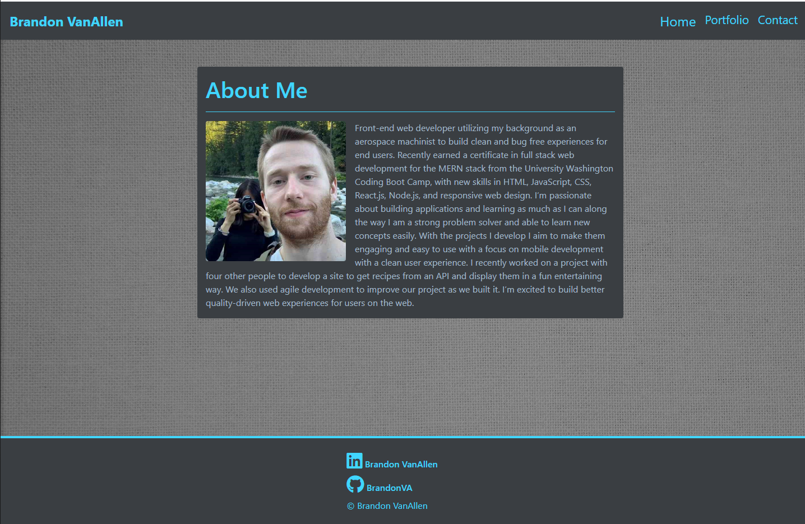

# Week 2 Homework | Responsive-Portfolio

### Table of Contents

- [Description](#Description)
- [Technologies](#Technologies)
- [License & copyright](#License)

# Project Image

> Screen shot of the homepage.

Here is a link to the [Live Site](https://brandonva.github.io/) 

Here is a link to the [Project Page](https://github.com/BrandonVA/BrandonVA.github.io)

# Description

This is my portfolio page where you can learn more about me and the work I do. I'm passionate about building web applications and solving problems. Please explore the live site to get to know more about me.

# Technologies 

- [Bootstrap](https://getbootstrap.com/)
- [favicon](https://favicon.io/)
- [Font Awsome Icons](https://fontawesome.com/)

# License 

© Brandon VanAllen
